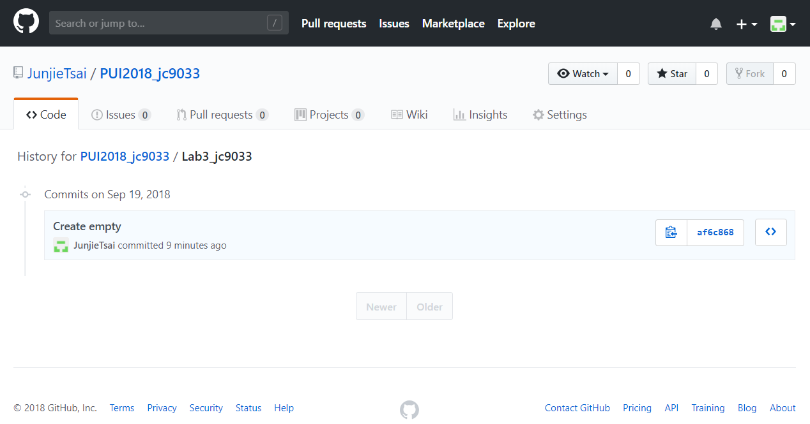

# Homework 2
Individual work by Junjie Cai

# Assignment 1: delete data and its history from a GitHub repo
1. Create a file in this repo inside of the folder Lab3_jc9033 called test.csv
 
 
2. commit this file to my repo and take a repo screen shot and a screenshot of the folder LB3_jc9033's history
 
 
3. Get the test.csv file locally.
4. Remove the file AND ITS HISTORY from the repo.
5. make sure the file was removed from local, and that there is no longer a test.csv file in the remote repo.
 
 
 # Assignment 2: Read CSV files with pandas and ise NYC open data portal
 1. Check that an environmental variable PUIDATA exists and that it points to the PUIdata directory.
 2. Download csv file to local(ADRF)
 3. Move this csv file to PUIDATA
 4. read in the data with pandas
 5. Display the top 7 rows of the dataset
 6. Remove all but 2 numerical values columns
 7. Display the reducted dataframe.
 8. Delete invalid rows
 9. Conversion time format
10. Plot the columns "Average Response Time" against "Number of Incidents" in a scatter plot
 
 # Extra Credit Assignment : work with and APIs and dates in Pandas
 1. Extract the same dataset data in json file using the NYC Open Data API
 2. read in the data with pandas
 3. Delete invalid columns and rows
 4. Conversion time format
 5. Plot the columns "Average Response Time" against "Year/ Month" in a line chart
 6. Plot the columns "Number of Incidents" against "Year/ Month" in a line chart
 7. Plot the columns "Average Response Time" against "Number of Incidents" in a scatter plot
 
 # Assignment 3: tracking each vehicle for a line
 1. Request and Get a API KEY from MTA
 2. Analyse and restruct Json file and find the related fields
 3. Load the Json file in python
 4. Extract useful items in python
 5. Print the output
 6. Add validation: make sure when error occurred, hints will be return

 # Assignment 4: next stop information
 1. Load the Json file in python
 2. Extract useful items in python
 3. Print the output
 4. write the output to the .csv
 5. valid the "bus stop": If no data for stops, print "N/A"