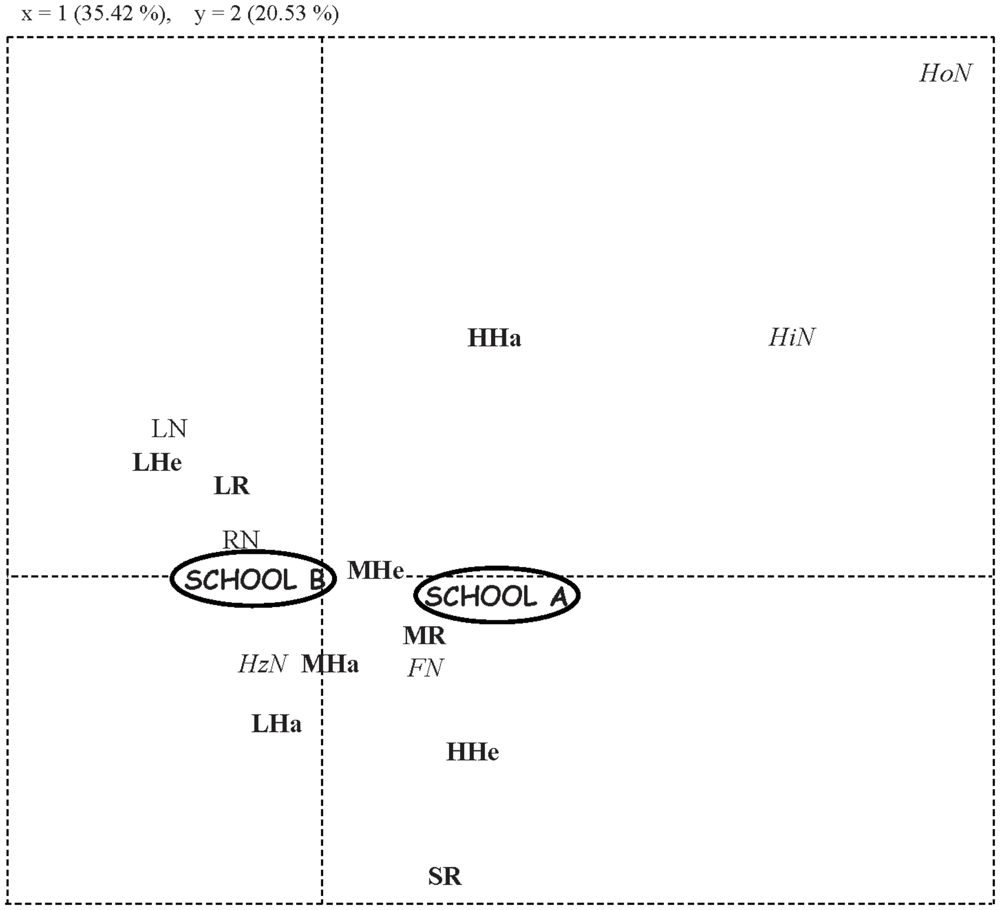
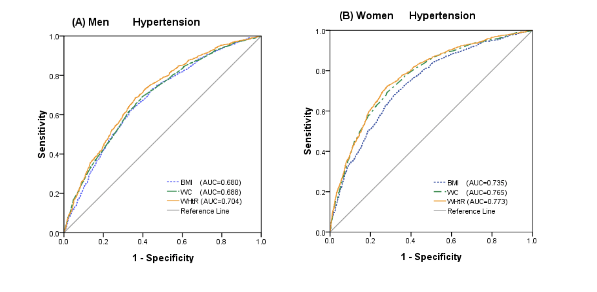

# Assignment 1
Individual work 
Please refer to the pull request: https://github.com/christinebidds22/PUI2018_cb4221/pull/1

	 a. Verify Null and alternative hypotheses 
The original hypothesis is a little bit confusing.  
	• Original Null hypothesis: CitiBike users born between 1980 are just as likely or more likely to use the service than those born in 1981. 
	• Original Alternative hypothesis: CitiBike users born between 1981 are more likely to use the service than those born between 1980.  

I would rephrase the hypothesis to be more precise about the expression and measurements.  
For example:  
	• Null hypothesis: The proportion of bike riding by CitiBike users who born in 1980 are the same or higher than the proportion of bike riding by CitiBike users who born in 1981. 
	• Alternative hypothesis: The proportion of bike riding by CitiBike users who born in 1980 are lower than the proportion of bike riding by CitiBike users who born in 1981. 

Addition suggestion: it will be meaningful to study the behavior of riders who have big difference of age.  
For example, we can compare the riding behavior of the middle-aged(46 to 60 years old) and the youth(16 to 30 years old): 
	• Null hypothesis: The proportion of bike riding by middle-aged CitiBike users(46 to 60 years old) are the same or higher than the proportion of bike riding by youth CitiBike users (16 to 30 years old). 
	• Alternative hypothesis: The proportion of bike riding by middle-aged CitiBike users(46 to 60 years old) are lower than the proportion of bike riding by youth CitiBike users (16 to 30 years old). 

	b. Verify that the data supports the project 
The present data still need to be deeper cleaned and analyzed to supports the project. First of all, the present data only has absolute counts without consideration of statistical errors. The statistical errors should be analyzed in the next step. Secondly, it is necessary to normalized the dataset to be proportions. Based on these data cleaning precedures, we can better carry on the futher statistical test. 

	 c. Chose statistical test 
T-test is an appropriate test to test the hypothesis in this case. 

First of all, there is difference between these 2 groups. And there is difference between these 2 groups on one DV. Groups or data sets are regarded as unpaired if there is no possibility of the values in one data set being related to or being influenced by the values in the other data sets. Different tests are required for quantitative or numerical data and qualitative or categorical data. For this hypothesis test, the groups are unpaired.  

Secondly, the independent variable is age(or equally birthyear). And for the two groups, it is dichotomous. At the same time, we are measuring the frequency of rides as dependent variable, and it is continuous. The data type coincides with t-test. 

# Assignment 2
Group Work with Effy Fan (yf1150)  
Contirbution:
* T-Test: Junjie Cai
* Correlation: Effy Fan
* Logistic Regression: Junjie Cai & Effy Fan

| **Statistical Analyses**	|  **IV(s)**  |  **IV type(s)** |  **DV(s)**  |  **DV type(s)**  |  **Control Var** | **Control Var type**  | **Question to be answered** | **_H0_** | **alpha** | **link to paper**| 
|:----------:|:----------|:------------|:-------------|:-------------|:------------|:------------- |:------------------|:----:|:-------:|:-------|
T-test	| 1, Did rats early exposure to isoflurane? | Categorical | 1, Amount of time the rats spend to complete task| Continuous | 1, age  2, gender  3, weaned_age  4, housing_lab  5, Lighting_hours  6, food_supply| 1, continuous  2, categorical  3, continuous  4, categorical  5, continuous  6, continuous | Do the amount of time the isoflurane group spend to complete task significantly higher than control group| Time test group <= Time control group | 0.001 | [Early Exposure to Volatile Anesthetics Impairs Long-Term Associative Learning and Recognition Memory](https://journals.plos.org/plosone/article?id=10.1371/journal.pone.0105340) |
Correlation	| 1, Time riders spent with low hands positions | Continuous | 1, Number of horses with high, round, or hollow neck position| Counts | 1, Riders' rein length  2, Riders' heel height | 1, Continuous 2, Continuous |	Number of horses with high, round, or hollow neck position when riders spent more time with low hands positions is significantly higher than the control group | Number of horses of test group <= Number of control group | 0.01 | [Human Direct Actions May Alter Animal Welfare, a Study on Horses (Equus caballus)](https://journals.plos.org/plosone/article?id=10.1371/journal.pone.0010257) |
Logistic Regression | 1, Waist-to-height ratio | Ratio | 1, Morbidity of hypertension | Ratio | N/A | N/A | Do the hypertension morbidity of people who has higher waist-to-height ratio(WHtR) significantly higher than the hypertension morbidity of people who has lower waist-to-height ratio(WHtR) | (Morbidity of WHtR≥0.5) <= (Morbidity WHtR <0.5) | 0.05 | [Waist-to-Height Ratio and Cardiovascular Risk Factors among Chinese Adults in Beijing](https://journals.plos.org/plosone/article?id=10.1371/journal.pone.0069298) |
  |||||||||

**Figure 1.
Object-context and social recognition.**   

**Figure 2.
FCA results based on horses' and riders' postures at work.
Riders' hands: high HHa, middle MHa, low LHa; Riders' heels: high HHe, middle MHe, low LHe; Reins length: short SR, medium MR, long LR, Horses' neck: high HN, horizontal HN, low LN, hollow HoN, flat FN, round RN.**   

**Figure 3.
ROC curves of the anthropometric indices for hypertension, diabetes, and dyslipidemia in men and women.**   

# Assignment 3
Individual work 

Reproduce the analysis of the Hard to Employ program in NY.
Did the Z-test and the Chi-squre test.

# Assignment 4
Individual work 
