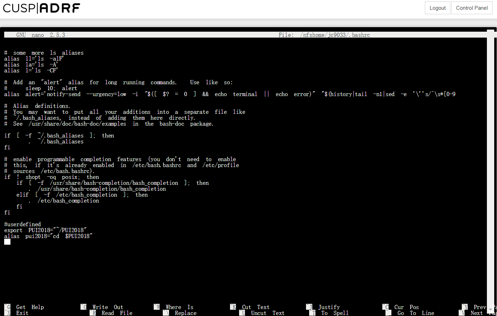

# Description of setting up my enviroment 

In order to set up my environment, I did such steps:   
	1. access my terminal on the CUSP ADRF   
	2. create an environmental variable: export PUI2018="<PUI2018>"   
	3. check the full path: echo $PUI2018   
	4. save an environmental variable permanently:   
		a. nano ~/.bashrc   
		b. Add lines: export PUI2018="~/PUI2018"   
		c. Add lines: alias pui2018="cd $PUI2018"   
	5. terminal reads the new version of the file as I modified it and store the new env variable and alias: source ~/.bashrc 

# Screenshoots
 
 
 